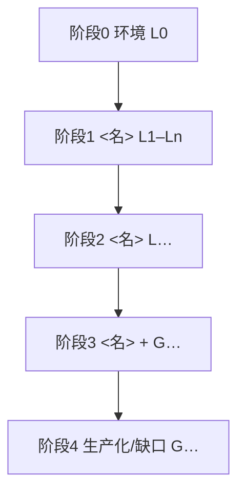

# 学习行动计划 — <一句话目标>

> **我是谁**：<背景与目标>
> **学习载体**：本仓库（<stack 摘要>）；fork：<fork-url>
> **我的方式（learning in public）**：公开记录「读懂真实实现 → 补齐背后概念 → 动手改一点 → 沉淀成可复用笔记」；踩坑与验证结论一并开源。

---

## 一、我要建立的能力地图

| 能力域 | 具体内容 | 本项目 |
| ------ | -------- | ------ |
| <域> | <要点> | ✅ / 🟡 / ❌ |

本项目已覆盖的部分，我先吃透真实实现；标 ❌ / 🟡 的缺口我放进 G 系列自己补，并公开记录过程。

---

## 二、分阶段学习路线

> 阶段图与阶段表在前；L / G 编号按阶段连续，避免「阶段一对应 L1、L8、L10」这种跳跃。

| 阶段 | 目标 | 学习项 | 主要产出 |
| ---- | ---- | ------ | -------- |
| 0 环境 | 本地跑通 | L0 | [01 启动](notes/01-env-setup.md) |
| 1 <名> | <目标> | L1–Ln | <笔记链接> |
| 2 <名> | <目标> | L… | <笔记链接> |
| 3 <名> | <目标> | L…、G… | <笔记链接> |
| 4 <名> | <目标> | G… | <笔记链接> |

---

## 三、本项目里我要系统深挖的技术亮点（L 系列）

> 每个亮点 = 读源码 → 建立概念 → 做一个小验证 → 沉淀笔记。编号按上面的阶段连续排列。

### 阶段 0 · 环境（前置）

| # | 主题 | 用在哪些功能模块 | 读什么（核心源码） | 笔记 |
|---|------|------------------|-------------------|------|
| L0 | 环境与工程基建 | 全模块运行前提 | <compose / 启动入口> | [01](notes/01-env-setup.md) |

### 阶段 1 · <名>（L1–Ln）

| # | 主题 | 用在哪些功能模块 | 读什么（核心源码） | 笔记 |
|---|------|------------------|-------------------|------|
| L1 | <主题> | <modules 链接> | <路径> | <modules + tech-qa> |

<!-- 按阶段继续拆表 -->

---

## 四、本项目没覆盖、我要补齐的能力（G 系列）

| # | 主题 | 现状 → 我要加什么 | 我的验收 | 笔记 |
|---|------|-------------------|----------|------|
| G1 | <主题> | <现状 → 动作> | <可验证标准> | ⬜ 待新增 |

---

## 五、我的执行原则

1. **先对模块、再挖技术**：学某个 L 项时先读 `notes/modules/`，再读 `notes/tech-qa/`。
2. **笔记已成篇 ≠ 学完**：对照笔记做小验证，动手项进 `code-changes/`。
3. **结论写回已有篇**：优先增补 modules / tech-qa，不平行再开一套编号。
4. **G 按缺口挂靠**：能挂进已有篇就挂；装不下再新建专篇。

---

## 六、笔记索引

- 项目全貌：`notes/01`–`03`
- 方向一：[modules/](notes/modules/README.md)
- 方向二：[tech-qa/](notes/tech-qa/README.md)
- 进度：[PROGRESS.md](PROGRESS.md)
