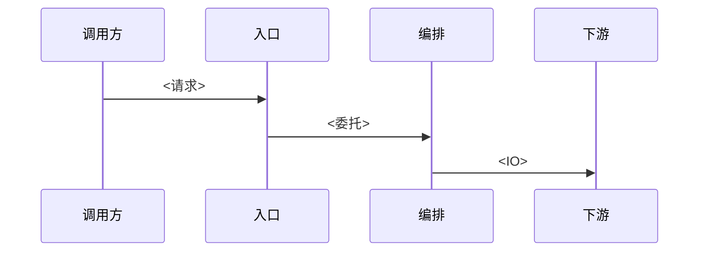

# 模块 <NN> · <中文名>（`<package-or-dir>`）

> 源码：`<main paths>`  
> 数据：`<tables / stores>`（见 [库表设计](../03-db-schema-design.md)）  
> 前端/入口：`<routes or N/A>`

<!-- 一句话：这个模块做什么，为什么值得我先读 -->

---

## 1. 一次请求 / 一次任务怎么走完

要点：<我读代码后的结论，例如「请求线程不调 LLM」>

---

## 2. 模块内分工

| 类 / 文件 | 职责 |
|-----------|------|
| `<Name>` | <职责> |

---

## 3. 这个模块用到的技术

| 技术 | 我怎么用到的 | 展开问答 |
|------|--------------|----------|
| <技术> | <落点一句话> | [tech-qa/…](../tech-qa/) |

---

## 4. 数据落在哪

| 存储 | 键 / 表 | 何时读写 |
|------|---------|----------|
| <DB/Redis/S3> | <名> | <时机> |

---

## 5. 我踩到的坑 / 待验证

1. **<标题>**：<现象与我的处理或待做小验证>
