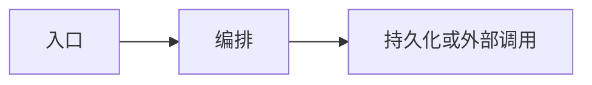

# 02 · 项目功能全景

> 我从用户可见能力与源码模块对照，讲清「有什么、入口在哪、主流程怎么走」。

## 模块一览

| 模块 | 用户侧能力 | 源码位置 | 笔记 |
|------|------------|----------|------|
| <名> | <能力> | `<path>` | [modules/…](modules/) |

## 页面 / API 入口

| 入口 | 路径 | 模块 |
|------|------|------|
| <页或 API> | `<route>` | <模块> |

## 主流程（我读懂的）

## 各模块用到的技术（对照）

| 模块 | 技术面 | tech-qa |
|------|--------|---------|
| <名> | <要点> | [..](tech-qa/) |

## 我还没跑通的交互

- <项> — 原因 / 下一步
